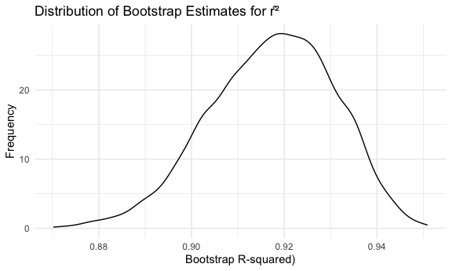
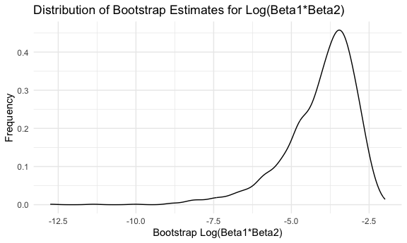

p8105_hw6_ah4167
================
Aiying Huang
2023-11-19

# Problem1

Create a city_state variable (e.g. “Baltimore, MD”), and a binary
variable indicating whether the homicide is solved. Omit cities Dallas,
TX; Phoenix, AZ; and Kansas City, MO – these don’t report victim race.
Also omit Tulsa, AL – this is a data entry mistake. For this problem,
limit your analysis those for whom victim_race is white or black. Be
sure that victim_age is numeric.

``` r
homicide_df <- read_csv("./data/homicide-data.csv", na = c("", "NA", "Unknown"))|>
  mutate(
    city_state = str_c(city, state, sep = ", "),
    resolution = case_when(
      disposition == "Closed without arrest" ~ "unsolved",
      disposition == "Open/No arrest"        ~ "unsolved",
      disposition == "Closed by arrest"      ~ "solved"
    )
  ) |>
  mutate(
    is_solved = ifelse(resolution == "solved", 1, 0)
  )|>
  filter(!(city_state %in% c("Dallas, TX", "Phoenix, AZ", "Kansas City, MO", "Tulsa, AL")) &
           (victim_race %in% c("White","Black")))|>
  mutate(
    victim_age=as.numeric(victim_age)
  )
```

    ## Rows: 52179 Columns: 12
    ## ── Column specification ────────────────────────────────────────────────────────
    ## Delimiter: ","
    ## chr (8): uid, victim_last, victim_first, victim_race, victim_sex, city, stat...
    ## dbl (4): reported_date, victim_age, lat, lon
    ## 
    ## ℹ Use `spec()` to retrieve the full column specification for this data.
    ## ℹ Specify the column types or set `show_col_types = FALSE` to quiet this message.

For the city of Baltimore, MD, use the glm function to fit a logistic
regression with resolved vs unresolved as the outcome and victim age,
sex and race as predictors. Save the output of glm as an R object; apply
the broom::tidy to this object; and obtain the estimate and confidence
interval of the adjusted odds ratio for solving homicides comparing male
victims to female victims keeping all other variables fixed.

``` r
baltimore_data=homicide_df|>
  filter(city_state=="Baltimore, MD")|>
  select(is_solved,victim_age,victim_sex,victim_race)
model = glm(is_solved ~ victim_age + victim_sex + victim_race, data = baltimore_data, family = binomial)
model|>
  broom::tidy()|>
  filter(term == "victim_sexMale")
```

    ## # A tibble: 1 × 5
    ##   term           estimate std.error statistic  p.value
    ##   <chr>             <dbl>     <dbl>     <dbl>    <dbl>
    ## 1 victim_sexMale   -0.854     0.138     -6.18 6.26e-10

``` r
# Calculate the confidence interval for male vs. female
estimate = model|>
  broom::tidy()|>
  filter(term == "victim_sexMale")|>
  pull(estimate)
std_error = model|>
  broom::tidy()|>
  filter(term == "victim_sexMale")|>
  pull(std.error)

# Set the confidence level (e.g., 95%)
confidence_level <- 0.95

# Calculate the critical value for the confidence interval
z <- qnorm((1 + confidence_level) / 2)

# Calculate the margin of error
margin_error <- z * std_error

# Calculate the lower and upper bounds of the confidence interval
lower_bound <- exp(estimate - margin_error)
upper_bound <- exp(estimate + margin_error)

# Print the estimate and its confidence interval
cat("Estimate:", exp(estimate), "\n")
```

    ## Estimate: 0.4255117

``` r
cat("95% Confidence Interval: (", lower_bound, ", ", upper_bound, ")\n")
```

    ## 95% Confidence Interval: ( 0.3245606 ,  0.5578627 )

Now run glm for each of the cities in your dataset, and extract the
adjusted odds ratio (and CI) for solving homicides comparing male
victims to female victims. Do this within a “tidy” pipeline, making use
of purrr::map, list columns, and unnest as necessary to create a
dataframe with estimated ORs and CIs for each city.

``` r
# Load the necessary libraries
library(dplyr)
library(purrr)
library(broom)

# Create a list column for each city
city_list = homicide_df |>
  group_by(city_state) |>
  nest()

# Define a function to fit logistic regression models and extract ORs and CIs
fit_logistic_regression <- function(data) {
  model = glm(is_solved ~ victim_age + victim_sex + victim_race, data = data, family = binomial)
  model_tidy = tidy(model)
  male_vs_female = model_tidy |>
    filter(term == "victim_sexMale")
  estimate = male_vs_female$estimate
  std_error = male_vs_female$std.error
  z = qnorm((1 + 0.95) / 2)  # 95% confidence interval
  margin_error = z * std_error
  lower_bound = exp(estimate - margin_error)
  upper_bound = exp(estimate + margin_error)
  tibble(
    city_state = unique(data$city_state),
    estimate = exp(estimate),
    ci_lower = lower_bound,
    ci_upper = upper_bound
  )
}

# Use purrr::map to fit models and extract adjusted ORs and CIs for each city
results = city_list |>
  mutate(city_results = map(data, fit_logistic_regression))

# Unnest the results to create a tidy dataframe
tidy_results = results |>
  unnest(city_results)

# View the estimated ORs and CIs for each city
head(tidy_results)
```

    ## # A tibble: 6 × 5
    ## # Groups:   city_state [6]
    ##   city_state      data                  estimate ci_lower ci_upper
    ##   <chr>           <list>                   <dbl>    <dbl>    <dbl>
    ## 1 Albuquerque, NM <tibble [178 × 14]>      1.77     0.831    3.76 
    ## 2 Atlanta, GA     <tibble [945 × 14]>      1.00     0.684    1.46 
    ## 3 Baltimore, MD   <tibble [2,753 × 14]>    0.426    0.325    0.558
    ## 4 Baton Rouge, LA <tibble [410 × 14]>      0.381    0.209    0.695
    ## 5 Birmingham, AL  <tibble [771 × 14]>      0.870    0.574    1.32 
    ## 6 Boston, MA      <tibble [492 × 14]>      0.667    0.354    1.26

Create a plot that shows the estimated ORs and CIs for each city.
Organize cities according to estimated OR, and comment on the plot.

``` r
# Load the necessary libraries
library(ggplot2)

# Assuming you have a dataframe "tidy_results" with estimated ORs and CIs for each city
# Organize the cities by estimated OR in descending order
tidy_results |>
  arrange(desc(estimate))|>
  ggplot(aes(x = reorder(city_state, estimate), y = estimate, ymin = ci_lower, ymax = ci_upper))+
  geom_point() +
  geom_errorbar() +
  labs(
    x = "City State",
    y = "Adjusted Estimated Odds Ratio (OR)",
    title = "Adjusted Estimated Odds Ratios and Confidence Intervals by City"
  ) +
  coord_flip()  # Rotate x-axis labels for better readability
```


# Problem 2

``` r
weather_df = 
  rnoaa::meteo_pull_monitors(
    c("USW00094728"),
    var = c("PRCP", "TMIN", "TMAX"), 
    date_min = "2022-01-01",
    date_max = "2022-12-31") |>
  mutate(
    name = recode(id, USW00094728 = "CentralPark_NY"),
    tmin = tmin / 10,
    tmax = tmax / 10) |>
  select(name, id, everything())
```

    ## using cached file: /Users/ivyhuang/Library/Caches/org.R-project.R/R/rnoaa/noaa_ghcnd/USW00094728.dly

    ## date created (size, mb): 2023-09-28 14:58:19.691413 (8.524)

    ## file min/max dates: 1869-01-01 / 2023-09-30

The boostrap is helpful when you’d like to perform inference for a
parameter / value / summary that doesn’t have an easy-to-write-down
distribution in the usual repeated sampling framework. We’ll focus on a
simple linear regression with tmax as the response with tmin and prcp as
the predictors, and are interested in the distribution of two quantities
estimated from these data:

- $\hat{r}^2$

- $log(\hat{\beta_1}*\hat{\beta_2})$

Use 5000 bootstrap samples and, for each bootstrap sample, produce
estimates of these two quantities. Plot the distribution of your
estimates, and describe these in words. Using the 5000 bootstrap
estimates, identify the 2.5% and 97.5% quantiles to provide a 95%
confidence interval for $\hat{r}^2$ and
$log(\hat{\beta_1}*\hat{\beta_2})$ . Note: broom::glance() is helpful
for extracting $\hat{r}^2$ from a fitted regression, and broom::tidy()
(with some additional wrangling) should help in computing
$log(\hat{\beta_1}*\hat{\beta_2})$.

``` r
lm(tmax~tmin+prcp,data=weather_df)|>
  broom::glance()
```

    ## # A tibble: 1 × 12
    ##   r.squared adj.r.squared sigma statistic   p.value    df logLik   AIC   BIC
    ##       <dbl>         <dbl> <dbl>     <dbl>     <dbl> <dbl>  <dbl> <dbl> <dbl>
    ## 1     0.916         0.915  2.96     1972. 2.19e-195     2  -912. 1832. 1848.
    ## # ℹ 3 more variables: deviance <dbl>, df.residual <int>, nobs <int>

``` r
lm(tmax~tmin+prcp,data=weather_df)|>
  broom::tidy()
```

    ## # A tibble: 3 × 5
    ##   term        estimate std.error statistic   p.value
    ##   <chr>          <dbl>     <dbl>     <dbl>     <dbl>
    ## 1 (Intercept)  8.04      0.230      35.0   4.39e-118
    ## 2 tmin         1.01      0.0162     62.7   1.43e-196
    ## 3 prcp        -0.00154   0.00210    -0.733 4.64e-  1

``` r
# Load the necessary libraries
library(dplyr)
library(modelr)
```

    ## 
    ## Attaching package: 'modelr'

    ## The following object is masked from 'package:broom':
    ## 
    ##     bootstrap

``` r
library(broom)

# Set the number of bootstrap samples
num_bootstraps = 5000

# Create a function to extract the desired quantities
extract_quantities = function(data) {
  # Fit the regression model 
  model = lm(tmax~tmin+prcp, data = data)
  
  # Extract r-squared using broom::glance
  r_squared = broom::glance(model)$r.squared
  
  # Extract model coefficients using broom::tidy
  model_coefficients = broom::tidy(model)
  
  # Calculate log(product of beta1 and beta2)
  log_beta_product = log(prod(model_coefficients$estimate))
  
  return(c(r_squared, log_beta_product))
}

# Perform bootstrap resampling and extract quantities for each sample
bootstrap_results <-weather_df|>
  modelr::bootstrap(n = num_bootstraps) %>%
  mutate(quantities = map(strap, extract_quantities))

# Convert the results into a data frame
bootstrap_df <- as.data.frame(do.call(rbind, bootstrap_results$quantities))

# Rename columns for clarity
colnames(bootstrap_df) <- c("R_squared", "Log_Beta_Product")

# Plot the distribution of your estimates
library(ggplot2)

ggplot(bootstrap_df, aes(x = R_squared)) +
  geom_density()+
  labs(x = "Bootstrap R-squared)", y = "Frequency") +
  ggtitle("Distribution of Bootstrap Estimates for r̂²")
```



``` r
ggplot(bootstrap_df, aes(x = Log_Beta_Product)) +
  geom_density()+
  labs(x = "Bootstrap Log(Beta1*Beta2)", y = "Frequency") +
  ggtitle("Distribution of Bootstrap Estimates for Log(Beta1*Beta2)")
```



$\hat{r}^2$ measures how well a model fits the data. The estimates of r
squared ranged from about 0.86 (not great) to 0.95 (pretty good). Most
of the estimates were around 0.91, which is quite good. And the
distribution of it is is a little left-skewed.

The $log(\hat{\beta_1}*\hat{\beta_2})$ ranged from about -13.4 to -2.0.
The higher the number, the stronger the influence of those two things.
Most of the numbers were around -4.0, suggesting a moderate influence.
And the distribution of it is left-skewed.

``` r
# Calculate 95% confidence intervals
conf_interval_r_squared <- quantile(bootstrap_df$R_squared, c(0.025, 0.975))
conf_interval_log_beta_product <- quantile(bootstrap_df$Log_Beta_Product, c(0.025, 0.975), na.rm = TRUE)

conf_interval_r_squared
```

    ##      2.5%     97.5% 
    ## 0.8893802 0.9407940

``` r
conf_interval_log_beta_product
```

    ##      2.5%     97.5% 
    ## -7.002941 -2.518747

The 95% confidence intervals for $\hat{r}^2$ is \[0.89,0.94\], and the
95% confidence intervals for $log(\hat{\beta_1}*\hat{\beta_2})$ is
\[-6.97,-2.45\]. (Note: There is 3362 na in the
$log(\hat{\beta_1}*\hat{\beta_2})$ data.)

# Problem 3

Load and clean the data for regression analysis (i.e. convert numeric to
factor where appropriate, check for missing data, etc.).

``` r
birthweight = read.csv("./data/birthweight.csv")

birthweight = birthweight|>
  mutate(
    babysex = case_when(
      babysex == 1 ~ "male",
      babysex == 2 ~ "female"
    ),
    frace = case_when(
      frace == 1 ~ "White",
      frace == 2 ~ "Black",
      frace == 3 ~ "Asian",
      frace == 4 ~ "Puerto Rican",
      frace == 8 ~ "Other",
      frace == 9 ~ "Unknown"
    ),
    mrace = case_when(
      mrace == 1 ~ "White",
      mrace == 2 ~ "Black",
      mrace == 3 ~ "Asian",
      mrace == 4 ~ "Puerto Rican",
      mrace == 8 ~ "Other"
    ),
    malform = case_when(
      malform == 0 ~ "absent",
      malform == 1 ~ "present"
    )
  )

na_values = c("", "NA", "Unknown")
birthweight = data.frame(lapply(birthweight, function(x) {
  if(is.numeric(x) || is.integer(x)) {
    x
  } else {
    x[x %in% na_values] = NA
    x
  }
}))

colSums(is.na(birthweight))
```

    ##  babysex    bhead  blength      bwt    delwt  fincome    frace  gaweeks 
    ##        0        0        0        0        0        0        0        0 
    ##  malform menarche  mheight   momage    mrace   parity  pnumlbw  pnumsga 
    ##        0        0        0        0        0        0        0        0 
    ##    ppbmi     ppwt   smoken   wtgain 
    ##        0        0        0        0

There is no missing value.

Propose a regression model for birthweight. This model may be based on a
hypothesized structure for the factors that underly birthweight, on a
data-driven model-building process, or a combination of the two.
Describe your modeling process and show a plot of model residuals
against fitted values – use add_predictions and add_residuals in making
this plot.

``` r
library(modelr)
# Fit the initial model
initial_model = lm(bwt ~ gaweeks + malform + ppbmi + momage + wtgain + smoken + fincome, data = birthweight)

initial_model|>summary()
```

    ## 
    ## Call:
    ## lm(formula = bwt ~ gaweeks + malform + ppbmi + momage + wtgain + 
    ##     smoken + fincome, data = birthweight)
    ## 
    ## Residuals:
    ##     Min      1Q  Median      3Q     Max 
    ## -1925.1  -280.1    -3.2   287.5  1534.0 
    ## 
    ## Coefficients:
    ##                Estimate Std. Error t value Pr(>|t|)    
    ## (Intercept)    -55.8148    98.2048  -0.568    0.570    
    ## gaweeks         58.5953     2.1895  26.762  < 2e-16 ***
    ## malformpresent  -5.2322   115.1617  -0.045    0.964    
    ## ppbmi           16.7891     2.1435   7.833 5.97e-15 ***
    ## momage          10.5574     1.8643   5.663 1.58e-08 ***
    ## wtgain          10.1537     0.6314  16.080  < 2e-16 ***
    ## smoken          -7.5672     0.9163  -8.259  < 2e-16 ***
    ## fincome          2.0575     0.2761   7.452 1.10e-13 ***
    ## ---
    ## Signif. codes:  0 '***' 0.001 '**' 0.01 '*' 0.05 '.' 0.1 ' ' 1
    ## 
    ## Residual standard error: 444.6 on 4334 degrees of freedom
    ## Multiple R-squared:  0.2475, Adjusted R-squared:  0.2463 
    ## F-statistic: 203.6 on 7 and 4334 DF,  p-value: < 2.2e-16

``` r
# Since the malformpresent is not significant, we remove it from the model
modified_model = lm(bwt ~ gaweeks + ppbmi + momage + wtgain + smoken + fincome, data = birthweight)

modified_model|>summary()
```

    ## 
    ## Call:
    ## lm(formula = bwt ~ gaweeks + ppbmi + momage + wtgain + smoken + 
    ##     fincome, data = birthweight)
    ## 
    ## Residuals:
    ##      Min       1Q   Median       3Q      Max 
    ## -1925.08  -280.04    -3.17   287.51  1533.99 
    ## 
    ## Coefficients:
    ##             Estimate Std. Error t value Pr(>|t|)    
    ## (Intercept) -55.8191    98.1934  -0.568     0.57    
    ## gaweeks      58.5965     2.1891  26.768  < 2e-16 ***
    ## ppbmi        16.7889     2.1433   7.833 5.93e-15 ***
    ## momage       10.5555     1.8636   5.664 1.57e-08 ***
    ## wtgain       10.1528     0.6310  16.089  < 2e-16 ***
    ## smoken       -7.5685     0.9157  -8.265  < 2e-16 ***
    ## fincome       2.0577     0.2760   7.454 1.08e-13 ***
    ## ---
    ## Signif. codes:  0 '***' 0.001 '**' 0.01 '*' 0.05 '.' 0.1 ' ' 1
    ## 
    ## Residual standard error: 444.6 on 4335 degrees of freedom
    ## Multiple R-squared:  0.2475, Adjusted R-squared:  0.2464 
    ## F-statistic: 237.6 on 6 and 4335 DF,  p-value: < 2.2e-16

``` r
# Now all the beta is significant, thus we keep the model as the final edition

# Add predictions and residuals
birthweight |>
  add_predictions(modified_model, var = "pred_bwt") |>
  add_residuals(modified_model, var = "residuals")|>
  ggplot(
    aes(x=pred_bwt,y=residuals)
  )+
  geom_point()+  # scatter plot of the residuals
  geom_hline(yintercept = 0, linetype = "dashed", color = "red") +  # a horizontal line at y = 0
  labs(title = "Residuals vs Fitted Values", x = "Fitted Values", y = "Residuals")
```


Based on the given variables, we can propose that birthweight (bwt) is
influenced by factors related to the baby’s health (such as gaweeks and
malform), the mother’s health and characteristics (including ppbmi,
momage, wtgain, and smoken), and socio-economic factors (fincome). After
using the summary() function to examine the results, we observed that
the coefficient for malform is not statistically significant.
Consequently, we decided to remove this variable and create a new
regression model. Upon analyzing the new model, we found that all
variables had statistically significant coefficients. As a result, we
retained the new model as the final model.

Compare your model to two others:

One using length at birth and gestational age as predictors (main
effects only) One using head circumference, length, sex, and all
interactions (including the three-way interaction) between these Make
this comparison in terms of the cross-validated prediction error; use
crossv_mc and functions in purrr as appropriate.

Note that although we expect your model to be reasonable, model building
itself is not a main idea of the course and we don’t necessarily expect
your model to be “optimal”.

``` r
library(purrr)
calculate_mse = function(formula, data) {
  # Perform cross-validation
  folds = crossv_mc(data, 10)  # 10-fold cross-validation
  
  # Function to calculate MSE for a single fold
  mse_fold = function(df_train, df_test) {
    model = lm(formula, data = df_train)
    predictions = predict(model, newdata = df_test$data)
    mean((df_test$data$bwt - predictions)^2)
  }

  # Calculate MSE for each fold and take the average
  mse_values = map2_dbl(folds$train, folds$test, mse_fold)
  mean(mse_values)
}
# Define the model formulas
formula_original = as.formula("bwt ~gaweeks + ppbmi + momage + wtgain + smoken + fincome")  
formula_length_gaweeks = as.formula("bwt ~ blength + gaweeks")
formula_head_length_sex_interactions = as.formula("bwt ~ bhead * blength * babysex")
```

``` r
# Calculate MSE for each model
mse_original = calculate_mse(formula_original, birthweight)
mse_length_gaweeks = calculate_mse(formula_length_gaweeks, birthweight)
mse_head_length_sex_interactions = calculate_mse(formula_head_length_sex_interactions, birthweight)

list(
  mse_original = mse_original,
  mse_length_gaweeks = mse_length_gaweeks,
  mse_head_length_sex_interactions = mse_head_length_sex_interactions
)
```

    ## $mse_original
    ## [1] 197466.8
    ## 
    ## $mse_length_gaweeks
    ## [1] 111033.3
    ## 
    ## $mse_head_length_sex_interactions
    ## [1] 82724.56

We can see from the mse got from the cross validation that the last
model is the best since it has the smallest mse. Probably because it
considered the interaction of variables thus it can fit the data better.
